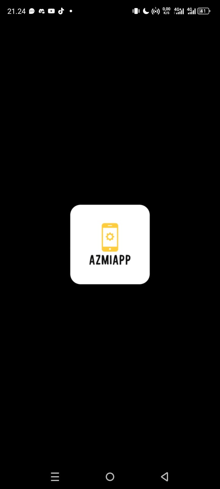
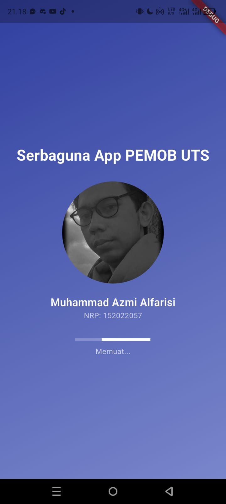
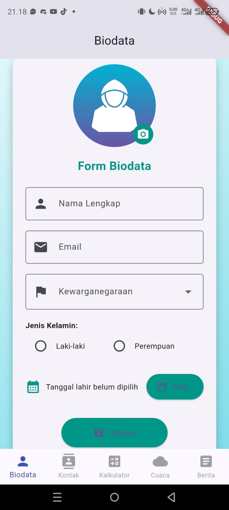
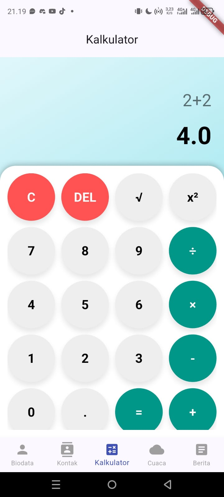
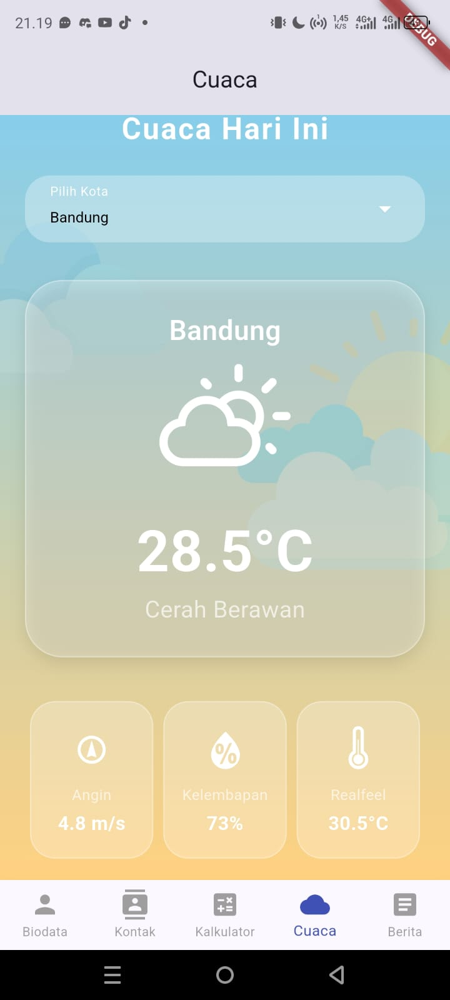
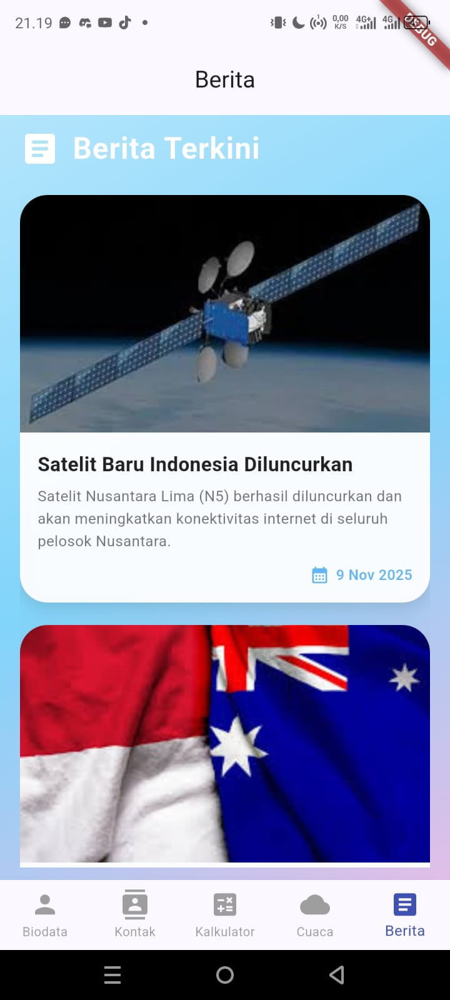

# UTS Pemrograman Mobile – Serbaguna App

Proyek ini merupakan pengembangan aplikasi mobile berbasis Flutter sebagai tugas UTS Pemrograman Mobile.
Aplikasi menampilkan beberapa page interaktif dengan tampilan modern, responsif, dan konsisten menggunakan tema biru muda lembut.

## 📝 Jawaban Soal Nomor 1 (UTS Pemrograman Mobile)

### Apa yang dimaksud dengan Pemrograman Mobile?

Pemrograman mobile adalah proses pengembangan aplikasi yang dijalankan pada perangkat mobile seperti smartphone dan tablet (Android maupun iOS). Aplikasi ini dibuat menggunakan bahasa pemrograman dan framework yang mendukung platform mobile salah satunya Flutter, yang menggunakan bahasa Dart.
Dalam pemrograman mobile, pengembang perlu mempertimbangkan berbagai faktor seperti ukuran layar yang bervariasi, keterbatasan daya baterai, koneksi internet, serta interaksi pengguna melalui sentuhan (touch screen).

---

### Karakteristik Utama Pemrograman Mobile
1. **Portabilitas Tinggi (Cross-Platform):**  
   Aplikasi mobile dapat dikembangkan untuk berjalan di berbagai sistem operasi (misalnya Android & iOS) menggunakan framework seperti Flutter atau React Native.

2. **Optimasi Performa & Resource:**  
   Aplikasi harus ringan, hemat memori, dan tidak boros baterai karena keterbatasan hardware perangkat mobile.

3. **UI Responsif & Interaktif:**  
   Desain antarmuka harus mudah digunakan di layar kecil, menggunakan komponen UI responsif, gesture, dan animasi halus.

4. **Integrasi Fitur Perangkat:**  
   Pemrograman mobile memungkinkan akses ke sensor perangkat seperti GPS, kamera, accelerometer, dan notifikasi.

5. **Distribusi via Store:**  
   Aplikasi mobile umumnya dipublikasikan melalui Google Play Store (Android) atau App Store (iOS), tidak seperti aplikasi desktop yang diinstal manual.

---

### Perbedaan dengan Pemrograman Desktop dan Web

| Aspek | Pemrograman Mobile | Pemrograman Desktop | Pemrograman Web |
|-------|--------------------|---------------------|-----------------|
| **Platform** | Smartphone, tablet | PC/laptop | Browser |
| **Bahasa Umum** | Dart (Flutter), Java (Android), Swift (iOS) | Java, C#, C++, Python | HTML, CSS, JavaScript |
| **UI/UX** | Touchscreen, gesture | Mouse & keyboard | Klik & scroll browser |
| **Instalasi** | Melalui store (Play Store/App Store) | Manual via installer | Akses langsung via URL |
| **Koneksi Internet** | Sering dibutuhkan (API, GPS, cloud) | Tidak selalu | Wajib untuk konten |
| **Keterbatasan Hardware** | RAM & baterai terbatas | Sumber daya besar | Bergantung browser |

---

### Kesimpulan
Pemrograman mobile berfokus pada pengembangan aplikasi yang efisien, ringan, dan interaktif untuk perangkat genggam. Berbeda dengan desktop dan web, pengembangan mobile menuntut optimasi antarmuka pengguna serta integrasi langsung dengan fitur perangkat, menjadikannya salah satu bidang paling dinamis dalam dunia pemrograman modern.

---

# Aplikasi yang dibuat
## Tentang aplikasi
Aplikasi terdiri dari Splash Screen dan Dashboard utama dengan 5 menu utama:Biodata, Kontak, Kalkulator, Cuaca, Berita. Splash Screen ditampilkan selama 5 detik. Setelah waktu habis, otomatis berpindah ke halaman Dashboard utama.
## Halaman Biodata (`biodata_page.dart`)

Form interaktif untuk mengisi data pribadi pengguna.

**Fitur yang tersedia:**
- Upload foto profil dari galeri.
- Input nama lengkap dan email.
- Dropdown kewarganegaraan (10+ negara ASEAN).
- Pilihan jenis kelamin (Radio Button).
- Pemilihan tanggal lahir (Date Picker).
- Tombol **Simpan**, menampilkan notifikasi
- Tampilan dengan gradasi warna biru lembut dan kartu dengan bayangan halus.

---

## Halaman Kontak (`kontak_page.dart`)

Menampilkan daftar kontak (15 orang) dalam bentuk **Card List**.

**Setiap item berisi:**
- Foto profil.
- Nama dan nomor telepon.
- Ikon telepon dan pesan
- Desain menggunakan gradient background biru lembut.

---

## Halaman Kalkulator (`kalkulator_page.dart`)

Kalkulator ilmiah sederhana berbasis **Math Expressions**.

**Fitur utama:**
- Operasi dasar: tambah (+), kurang (-), kali (×), bagi (÷).
- Fungsi akar (√) dan pangkat dua (x²).
- Tombol `C` (Clear) dan `DEL` (Hapus satu karakter).
- Menampilkan input dan hasil perhitungan secara real-time.
- Tampilan dengan grid tombol bundar elegan dan layar hasil besar di bagian atas.

---

## Halaman Cuaca (`cuaca_page.dart`)

Menampilkan informasi cuaca harian untuk beberapa kota di Indonesia.

**Data lokal (statis)** mencakup:
> Bandung, Jakarta, Yogyakarta, Surabaya, Bali, Medan.

**Informasi meliputi:**
- Suhu (°C)
- Kondisi cuaca (Cerah, Hujan, Panas, dll)
- Ikon cuaca dari package `weather_icons`
- Tambahan info: kecepatan angin, kelembapan, dan *“realfeel”*.

**Tampilan:**  
Background gradien langit-oranye, awan dekoratif, dan kartu transparan modern.

---

## Halaman Berita (`berita_page.dart`)

Menampilkan daftar berita terkini (7 berita) dengan **judul**, **deskripsi singkat**, dan **gambar**.

**Contoh berita:**
- Satelit Baru Indonesia Diluncurkan

**Tampilan:**  
Gradasi biru–ungu pastel agar terasa lembut dan nyaman dibaca.

## Tampilan aplikasi
| Halaman | Screenshot |
|----------|-------------|
| Icon |  |
| Splash Screen |  |
| Biodata |  |
| Kontak |  |
| Kalkulator |  |
| Cuaca |  |
| Berita |  |

## Cara Menjalankan Aplikasi

1. **Clone atau download repositori ini:**
   ```bash
   git clone https://github.com/mersu14/uts_pemob.git
   cd uts_pemob
3. Install dependencies Flutter:
   ```bash
   flutter pub get
5. Jalankan aplikasi:
   ```bash
   flutter run
7. Pastikan emulator atau perangkat Android sudah aktif.
> Jika menggunakan perangkat fisik, aktifkan USB Debugging pada Developer Options.
> Jika mengalami error INSTALL_FAILED_USER_RESTRICTED, izinkan instalasi aplikasi dari komputer di perangkat kamu.
> Jika ingin mengganti ikon aplikasi, jalankan perintah:
   ```bash
  flutter pub run flutter_launcher_icons
